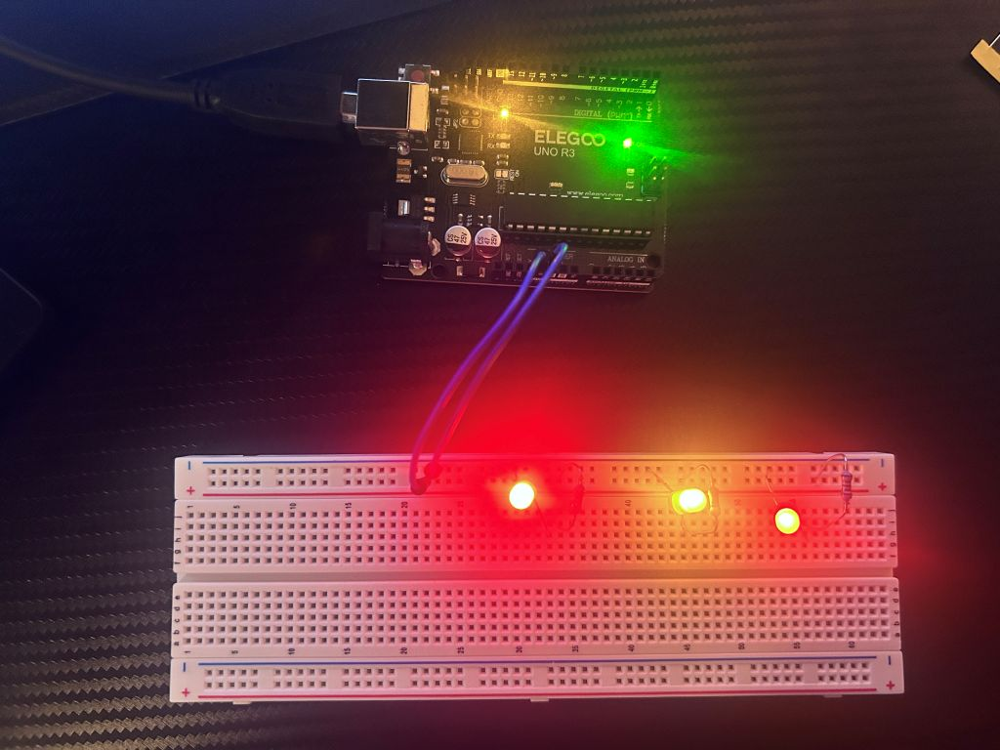

# led-board
A walkthrough of hooking up some LEDs to a breadboard using the UNO R3 as a power source.

- **Left LED** *(red)*
  - 220 ohm Resistor
- **Middle LED** *(yellow)*
  - 330 ohm Resistor
- **Right LED** *(red)*
  - 10 ohm Resistor
  
The UNO supplies 5 volts. Two M-M jumper wires connect the 5V header to the positive side of the breadboard 
and the GND header to the negative side of the breadboard.

This gives 5V going to one lead of the resistor, and the other lead going to the positive side of the LED.
The other side of the LED goes to GND.